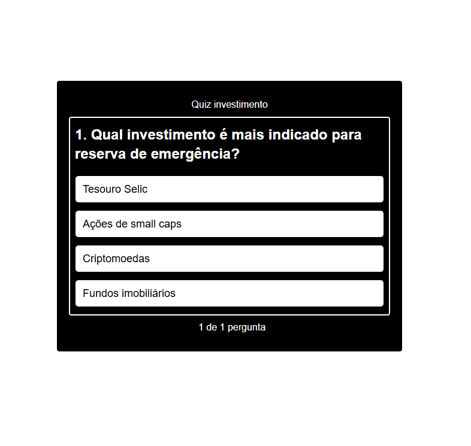

<!-- BANNER SUPERIOR -->
<div align="center">

# 💰 Investment Quiz

Interactive quiz application designed to test and improve knowledge about investments and financial concepts.

</div>

---

## 📋 About the Project

This project is an interactive quiz focused on investment concepts. The application allows users to test their knowledge through multiple-choice questions, providing immediate visual feedback for correct and incorrect answers.

The goal of this project was to practice **React state management**, **dynamic rendering**, and **user interaction in frontend applications**.

---

## 🛠️ Technologies Used

<div align="center">


</div>

---

## ✨ Features

- Interactive multiple-choice quiz
- Real-time feedback for answers
- Visual indication of correct and incorrect options
- Clean and responsive interface
- Dynamic question rendering

---

## 📷 Preview

<div align="center">



</div>

---

## 🚀 Installation and Usage

### Prerequisites

- Node.js installed

### Step by step

```bash
# Clone the repository
git clone https://github.com/vilhegas/investment-quiz.git

# Enter the project folder
cd investment-quiz

# Install dependencies
npm install

# Run the project
npm run dev
